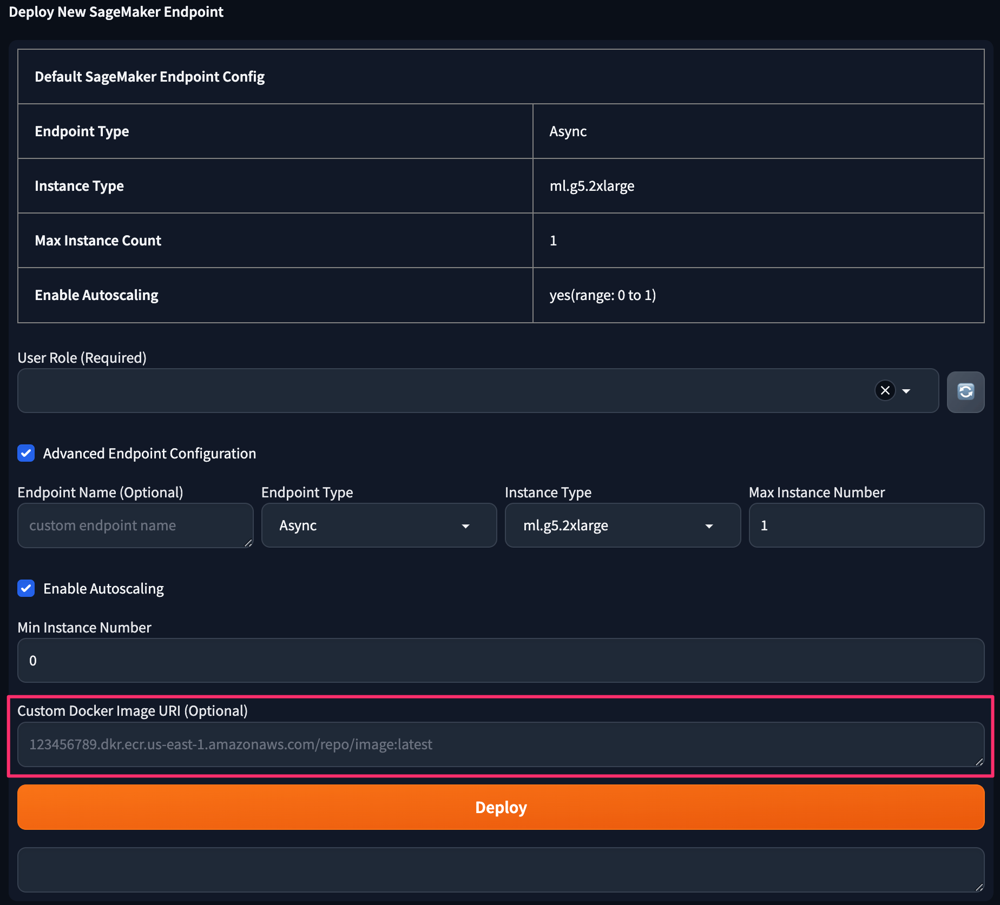

<!-- Generator: Widdershins v4.0.1 -->

<h1 id="stable-diffusion-train-and-deploy-api">Custom Container</h1>

# Overview

The **Extension for Stable Diffusion on AWS** is extremely flexible. You can replace the container image of the SageMaker Endpoint model at any time.

To achieve this capability, follow these steps:

- Step 1: Build a Container Image
- Step 2: Create Endpoint using custom container image
- Step 3: Verify or diagnose whether the container image is work

<br>

# Build a Container Image

You can build your own container image and upload it to [Amazon ECR](https://console.aws.amazon.com/ecr){:target="_blank"} in the region where the solution is deployed, please read [Using Amazon ECR with the AWS CLI](https://docs.aws.amazon.com/AmazonECR/latest/userguide/getting-started-cli.html){:target="_blank"}
, after the operation is complete, you will get a ECR URI, such as:

```shell
{your_account_id}.dkr.ecr.{region}.amazonaws.com/your-image:latest
```

Dockerfile template:

```dockerfile
# It is recommended to use the Image created by the solution as the base image.
FROM {your_account_id}.dkr.ecr.{region}.amazonaws.com/stable-diffusion-aws-extension/aigc-webui-inference:latest

# Download the extension
RUN mkdir -p /opt/ml/code/extensions/ && \
    cd /opt/ml/code/extensions/ && \
    git clone https://github.com/**.git

```

<br>

# Create Endpoint using custom container image

Create a role named `byoc` and add the logged-in user to that role to activate the function shown in the following picture:




<br>

# Verify or diagnose whether the container image is work

After the container image is replaced, you can verify whether the container image is working properly by viewing the logs of the SageMaker Endpoint, or diagnose the cause of the problem:

- **{region}**: The region where the solution is deployed, such as: `us-east-1`
- **{endpoint-name}**: Endpoint name, such as: `infer-endpoint-111111`

```shell
https://{region}.console.aws.amazon.com/cloudwatch/home?region={region}#logsV2:log-groups$3FlogGroupNameFilter$3D{endpoint-name}
```
