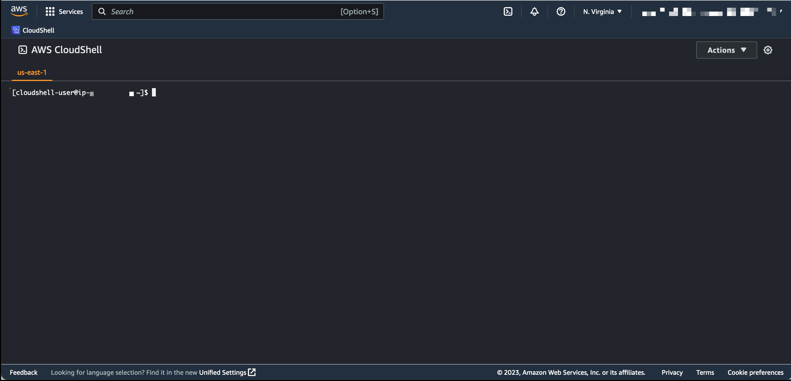

<!-- Generator: Widdershins v4.0.1 -->

<h1 id="stable-diffusion-train-and-deploy-api">自定义容器镜像</h1>

# 概述

Stable Diffusion 亚马逊云科技插件解决方案具有极高的灵活性，您可以随时替换 SageMaker Endpoint 模型的容器镜像，也可以随时恢复到默认镜像。

为了实现这个能力，请按照以下步骤操作：

- 第一步：构建容器镜像
- 第二步：准备命令执行环境和权限
- 第三步：将指定的 SageMaker Endpoint 模型镜像**替换**为您自己的容器镜像或**恢复**为默认镜像
- 第四步：验证或诊断容器镜像是否正常工作

<br>

# 准备容器镜像

您可自行构建容器镜像（**强烈建议您在更换镜像前验证该镜像是否正常**），验证后将镜像上传到和部署方案相同区域的 [Amazon ECR](https://console.aws.amazon.com/ecr){:target="_blank"}
中，详细请阅读 [将 Amazon ECR 与 AWS CLI 结合使用](https://docs.aws.amazon.com/zh_cn/AmazonECR/latest/userguide/getting-started-cli.html){:target="_blank"}
，操作完成后，您将获得一个镜像 URI，如：

```shell
123456789012.dkr.ecr.cn-northwest-1.amazonaws.com.cn/your-image:latest
```

Dockerfile 模板如下：

```dockerfile
# Use a specific version for reproducibility
FROM 763104351884.dkr.ecr.us-east-1.amazonaws.com/pytorch-inference:2.0.1-gpu-py310-cu118-ubuntu20.04-sagemaker

# Set environment variables to non-interactive (this prevents some prompts)
ENV DEBIAN_FRONTEND=non-interactive

# Install system packages in a single RUN step to reduce image size
RUN apt-get update -y && \
    apt-get install -y \
    your-package \
    rm -rf /var/lib/apt/lists/*

# Set your entrypoint
ENTRYPOINT ["python", "/your/serve"]

```

<br>

# 准备命令执行的权限环境

## 权限

请确保您的账户具备足够的权限，否则执行命令会因为权限不足而失败，请将该示例策略附加到您的 IAM 用户或角色，**注意**替换变量 `{Partition}`，`{Region}`  和 `{Account}` 为您自己的区域和账户：

```json
{
  "Version": "2012-10-17",
  "Statement": [
    {
      "Sid": "StableDiffusionOnAWSExtensionEndpoint",
      "Effect": "Allow",
      "Action": [
        "sagemaker:DescribeModel",
        "sagemaker:DescribeEndpoint",
        "sagemaker:DescribeEndpointConfig",
        "sagemaker:DeleteModel",
        "sagemaker:DeleteEndpoint",
        "sagemaker:DeleteEndpointConfig",
        "sagemaker:CreateModel",
        "sagemaker:CreateEndpoint",
        "sagemaker:CreateEndpointConfig"
      ],
      "Resource": [
        "arn:${Partition}:sagemaker:${Region}:${Account}:model/infer-model-*",
        "arn:${Partition}:sagemaker:${Region}:${Account}:endpoint/infer-endpoint-*",
        "arn:${Partition}:sagemaker:${Region}:${Account}:endpoint-config/infer-config-*"
      ]
    },
    {
      "Effect": "Allow",
      "Action": "iam:PassRole",
      "Resource": "arn:${Partition}:iam::${Account}:role/*createEndpoint*"
    },
    {
      "Effect": "Allow",
      "Action": "application-autoscaling:DeregisterScalableTarget",
      "Resource": "*"
    }
  ]
}
```

## 环境

关于执行后续命令的环境，有两种方式：

- **方式一（推荐）**：打开并登录 [CloudShell](https://docs.aws.amazon.com/zh_cn/cloudshell/latest/userguide/welcome.html){:target="_blank"} ，在终端初始化完成后执行命令，请将 {region} 更换为您方案部署的区域，如：`us-east-1`
    - 登录地址：https://{region}.console.aws.amazon.com/cloudshell/home
    - 
- **方式二**：在您自己的环境中执行，您需要：
    - 安装 [CURL](https://curl.se/){:target="_blank"}
    - 安装并配置 [AWS CLI](https://docs.aws.amazon.com/zh_cn/cli/latest/userguide/cli-chap-getting-started.html){:target="_blank"}

<br>

# 使用自定义容器镜像

准备好镜像后，您只需替换以下命令中的变量，并执行命令，即可完成更换镜像：

- **{region}**：方案部署的区域，如：`us-east-1`
- **{endpoint-name}**：Endpoint 名称，如：`infer-endpoint-111111`
- **{image-uri}**：容器镜像 URI

```shell
curl -s https://raw.githubusercontent.com/awslabs/stable-diffusion-aws-extension/main/build_scripts/update_endpoint_image.sh | bash -s {region} {endpoint-name} {image-uri}
```

<br>

效果如下：


<br>


# 验证或诊断容器镜像

强烈建议您在更换镜像后验证或诊断容器镜像是否正常工作，如需查看日志，您可进入 Endpoint 的日志组查看日志：

- **{region}**：方案部署的区域，如：`us-east-1`
- **{endpoint-name}**：Endpoint 名称，如：`infer-endpoint-111111`

```shell
https://{region}.console.aws.amazon.com/cloudwatch/home?region={region}#logsV2:log-groups$3FlogGroupNameFilter$3D{endpoint-name}
```
