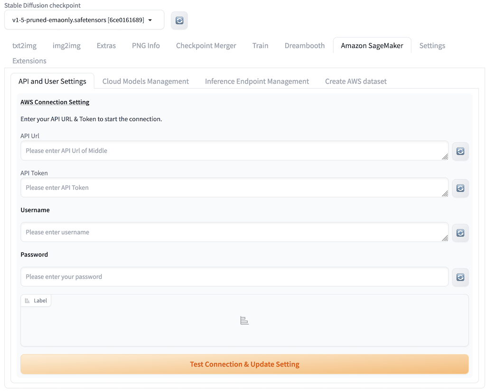
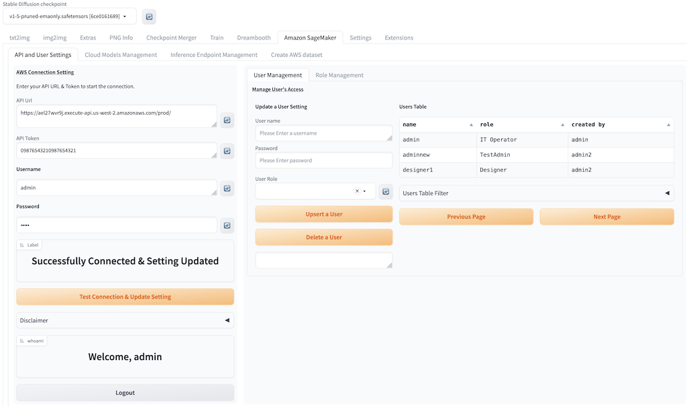

# 配置API和多用户

## 配置API
1. 访问[AWS CloudFormation控制台](https://console.aws.amazon.com/cloudformation/)，选择成功部署的本解决方案的主堆栈。
2. 打开输出（Outputs）标签页，找到**APIGatewayUrl**和**ApiGatewayUrlToken**对应的数值，并复制。
3. 打开Stable Diffusion WebUI中的**Amazon SageMaker**标签页，在**API URL**文本框粘贴步骤2得到的URL，在**API Token**输入步骤2得到的token。在**Username**及**Password**文本框请填入初始超级管理员角色名称及密码。点击**Test Connection & Update Setting**。
4. 当提示信息**Successfully Connected & Setting Updated**显示后，表明前端已经和后端云资源成功链接，同时配置文件得到更新，以便在未来启动webUI时能自动打出对应信息。

5. 在后台重启webUI，以使得全功能生效。

## 多用户管理
IT Operator角色用户登录成功后，进入到**Amazon SageMaker**标签页，**API and User Settings**子标签页下可以进行角色及用户管理页面。

### 角色管理
在**Role Management**标签页下，可以按需求查看、创建角色并配置相应权限。新增角色后，可以通过点击`Next Page`或刷新页面来更新在**Role Table**中。

### 用户管理
在**User Management**标签页下，可以按需查看、创建、更新或删除用户。
#### 创建新用户
1. 根据具体需求，创建所有新的用户、密码和角色，点击`Next Page`后， 可以看到新创建的用户。
2. 打开另一个无痕浏览器，使用新创建的用户名、密码登录。
3. 进入到**Amazon SageMaker**页，不同的用户展示的内容有所不同。

#### 管理现有用户
1. 在表**User Table**中选择需要更新的用户，区域**Update a User Setting**将会显示该选中的用户信息。
2. 在**Password**或**User Role**处按需更新信息，并点击**Upsert a User**以保存改动。抑或点击**Delete a User**已完成删除该用户的操作。

